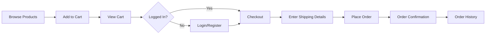

# 🛍️ DressUp — Full-Stack Streetwear E-Commerce Platform

<div align="center">


**A modern, full-stack e-commerce web application built for a premium streetwear brand.**

[Features](#-features) • [Demo](#-demo) • [Tech Stack](#-tech-stack) • [Getting Started](#-getting-started) • [API Documentation](#-api-documentation)

</div>

---

## 📖 About The Project

DressUp is a production-ready e-commerce platform featuring a clean, dark UI, complete admin management system, secure authentication, and scalable backend architecture. Built with modern web technologies, it closely resembles real-world systems used in contemporary e-commerce applications.

### 🎯 Key Highlights

- 🔐 Secure JWT-based authentication
- 🛒 Persistent shopping cart with localStorage
- 👨‍💼 Comprehensive admin dashboard
- 📦 Complete order management system
- 🖼️ Multi-image upload support
- 📱 Fully responsive design
- ⚡ Real-time stock management

---

## ✨ Features

### 🧑‍💻 User Features

- **Product Browsing**
  - Browse products by category
  - View featured products on homepage
  - Detailed product pages with images, pricing, and size variants
  
- **Shopping Experience**
  - Add products to cart with size & quantity selection
  - Persistent cart using localStorage
  - Secure checkout flow with authentication
  
- **Order Management**
  - Place orders with shipping details
  - Order success confirmation
  - View complete order history

### 🛠️ Admin Features

- **Authentication & Security**
  - Secure admin login
  - Role-based access control
  
- **Product Management**
  - Add, update, activate/deactivate products
  - Upload multiple product images
  - Manage product variants (sizes & stock levels)
  - Mark products as featured
  
- **Category Management**
  - Create and update categories
  - Upload category display images
  - Activate/deactivate categories
  - Soft delete support
  
- **Order Management**
  - View all customer orders
  - Update order status
  - Track order details

---

## 🧱 Tech Stack

### Frontend
```
⚛️  React.js (Vite)
🛣️  React Router
🎨 Tailwind CSS
📡 Axios
💾 LocalStorage
```

### Backend
```
🟢 Node.js
⚡ Express.js
🍃 MongoDB + Mongoose
🔐 JWT Authentication
✅ Zod (Validation)
```

### Tools & Services
```
📮 Postman (API Testing)
☁️  Cloudinary (Image Hosting)
📦 Git & GitHub
```

---

## 📁 Project Structure

```
DressUp/
│
├── client/                     # Frontend Application
│   ├── src/
│   │   ├── components/        # Reusable UI components
│   │   ├── pages/             # Page components
│   │   │   ├── admin/         # Admin dashboard pages
│   │   │   ├── Home.jsx       # Homepage
│   │   │   ├── Shop.jsx       # Product listing
│   │   │   ├── Product.jsx    # Product details
│   │   │   ├── Cart.jsx       # Shopping cart
│   │   │   ├── Checkout.jsx   # Checkout page
│   │   │   └── Auth/          # Login/Register
│   │   ├── lib/               # Utilities & helpers
│   │   │   ├── api.js         # API configuration
│   │   │   ├── auth.js        # Auth helpers
│   │   │   └── cart.js        # Cart management
│   │   ├── App.jsx
│   │   └── main.jsx
│   └── package.json
│
├── server/                     # Backend Application
│   ├── controllers/           # Request handlers
│   │   ├── authController.js
│   │   ├── productController.js
│   │   ├── categoryController.js
│   │   └── orderController.js
│   ├── models/                # Database models
│   │   ├── User.js
│   │   ├── Product.js
│   │   ├── Category.js
│   │   └── Order.js
│   ├── routes/                # API routes
│   ├── middleware/            # Custom middleware
│   │   ├── auth.js
│   │   └── adminAuth.js
│   ├── schemas/               # Zod validation schemas
│   ├── utils/                 # Utility functions
│   ├── server.js              # Entry point
│   └── package.json
│
├── .gitignore
├── README.md
└── LICENSE
```

---

## 🔐 Authentication & Authorization

- **JWT-based authentication** for secure user sessions
- Tokens stored in **localStorage** with automatic refresh
- **Axios interceptor** automatically attaches authorization headers
- **Role-based access control**:
  - `user` - Customer access
  - `admin` - Full platform access
- Protected admin routes for sensitive operations

---

## 🗄️ Data Models

### Product Model
```javascript
{
  title: String,
  slug: String,
  description: String,
  price: Number,
  compareAtPrice: Number,
  category: ObjectId (ref: Category),
  images: [String],
  variants: [{ size: String, stock: Number }],
  isFeatured: Boolean,
  isActive: Boolean,
  createdAt: Date,
  updatedAt: Date
}
```

### Category Model
```javascript
{
  name: String,
  slug: String,
  image: String,
  isActive: Boolean,
  isDeleted: Boolean,
  createdAt: Date,
  updatedAt: Date
}
```

### Order Model
```javascript
{
  user: ObjectId (ref: User),
  items: [{
    product: Object,
    quantity: Number,
    size: String,
    price: Number
  }],
  shippingDetails: {
    name: String,
    address: String,
    city: String,
    postalCode: String,
    phone: String
  },
  totalAmount: Number,
  status: String,
  createdAt: Date
}
```

---

## 🚀 Getting Started

### Prerequisites

- Node.js (v16 or higher)
- MongoDB (local or Atlas)
- npm or yarn
- Cloudinary account (for image uploads)

### 1️⃣ Clone the Repository

```bash
git clone https://github.com/yourusername/dressup.git
cd dressup
```

### 2️⃣ Backend Setup

```bash
cd server
npm install
```

Create a `.env` file in the `server` directory:

```env
PORT=5000
MONGO_URI=your_mongodb_connection_string
JWT_SECRET=your_super_secret_jwt_key
CLOUDINARY_CLOUD_NAME=your_cloudinary_name
CLOUDINARY_API_KEY=your_cloudinary_api_key
CLOUDINARY_API_SECRET=your_cloudinary_api_secret
```

Start the backend server:

```bash
npm run dev
```

The server will run on `http://localhost:5000`

### 3️⃣ Frontend Setup

Open a new terminal:

```bash
cd client
npm install
```

Create a `.env` file in the `client` directory:

```env
VITE_API_URL=http://localhost:5000/api
```

Start the development server:

```bash
npm run dev
```

The app will run on `http://localhost:5173`

### 4️⃣ Access the Application

- **Frontend**: http://localhost:5173
- **Backend API**: http://localhost:5000/api
- **Admin Panel**: http://localhost:5173/admin

---

## 🧪 API Documentation

### Authentication Endpoints

```http
POST   /api/auth/register      # Register new user
POST   /api/auth/login          # Login user
GET    /api/auth/me             # Get current user
```

### Product Endpoints

```http
GET    /api/products            # Get all products
GET    /api/products/:id        # Get single product
POST   /api/products            # Create product (Admin)
PUT    /api/products/:id        # Update product (Admin)
DELETE /api/products/:id        # Delete product (Admin)
GET    /api/products/featured   # Get featured products
```

### Category Endpoints

```http
GET    /api/categories          # Get all categories
GET    /api/categories/:id      # Get single category
POST   /api/categories          # Create category (Admin)
PUT    /api/categories/:id      # Update category (Admin)
DELETE /api/categories/:id      # Soft delete category (Admin)
```

### Order Endpoints

```http
POST   /api/orders              # Create order
GET    /api/orders              # Get user orders
GET    /api/orders/all          # Get all orders (Admin)
PUT    /api/orders/:id          # Update order status (Admin)
```

> 📝 For detailed API documentation, import the Postman collection from `/docs/postman_collection.json`

---

## 🎨 UI & Design

- **Dark Theme**: Premium streetwear aesthetic
- **Glassmorphism**: Modern card-based layouts with gradient accents
- **Responsive**: Mobile-first design (320px → 1920px+)
- **Animations**: Smooth hover transitions and micro-interactions
- **Typography**: Clean, readable fonts optimized for e-commerce

---

## 🛒 Order Flow



---

## 📸 Screenshots

### Homepage


### Product Details


### Admin Dashboard


> Add your screenshots in a `/screenshots` folder

---

## 🔧 Environment Variables

### Backend (.env)

| Variable | Description | Required |
|----------|-------------|----------|
| `PORT` | Server port number | Yes |
| `MONGO_URI` | MongoDB connection string | Yes |
| `JWT_SECRET` | Secret key for JWT tokens | Yes |
| `CLOUDINARY_CLOUD_NAME` | Cloudinary cloud name | Yes |
| `CLOUDINARY_API_KEY` | Cloudinary API key | Yes |
| `CLOUDINARY_API_SECRET` | Cloudinary API secret | Yes |

### Frontend (.env)

| Variable | Description | Required |
|----------|-------------|----------|
| `VITE_API_URL` | Backend API base URL | Yes |

---

## 📈 Future Enhancements

- [ ] Payment gateway integration (Stripe/Razorpay)
- [ ] Wishlist functionality
- [ ] Advanced search & filtering
- [ ] Product reviews & ratings
- [ ] Admin analytics dashboard
- [ ] Email notifications (order confirmations, shipping updates)
- [ ] SSR/SSG for better SEO
- [ ] Multi-language support
- [ ] Dark/Light mode toggle
- [ ] Social media authentication

---

## 🤝 Contributing

Contributions are welcome! Please follow these steps:

1. Fork the repository
2. Create your feature branch (`git checkout -b feature/AmazingFeature`)
3. Commit your changes (`git commit -m 'Add some AmazingFeature'`)
4. Push to the branch (`git push origin feature/AmazingFeature`)
5. Open a Pull Request

---

## 📝 License

This project is licensed under the MIT License - see the [LICENSE](LICENSE) file for details.

---

## 👤 Author

**Jawad Bin Hamid**

- Full-Stack Developer
- Passionate about building scalable, production-ready web applications
- GitHub: [@jawad](https://github.com/yourusername)
- LinkedIn: [Jawad Bin Hamid](https://linkedin.com/in/yourprofile)
- Email: your.email@example.com

---

## 🙏 Acknowledgments

- React.js Team for the amazing framework
- MongoDB Team for the flexible database
- Tailwind CSS for the utility-first CSS framework
- Cloudinary for image hosting
- The open-source community

---

<div align="center">

**⭐ Star this repo if you find it helpful!**

Made with ❤️ by Jawad Bin Hamid

</div>
